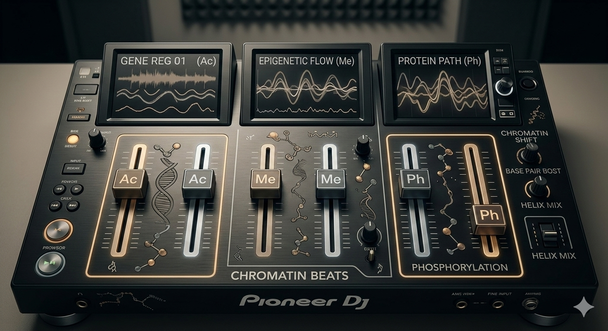

{fig-alt="Histone code illustration" width="100%"}

Every cell in your body has the exact same DNA. Your brain cells, your muscle cells, your skin cells — same genome, same sequence, same "song".

So how come a brain cell *acts* nothing like a muscle cell?

That was the question bugging scientists for years. And a 2000 paper in *Nature* gave us the most elegant answer: it's not the song that's different — it's the **volume control**.

**Today's paper:** "The language of covalent histone modifications" by Brian Strahl and David Allis (2000)

## The Playlist Analogy

Imagine the DNA is a song. Every cell in your body has a copy of the same song. Now, your brain loves the classical part. Your muscle cells are into the rap verse. Your stomach? Strictly jazz.

Nobody edits the song, it is the same for everyone. But in each cell, something is quietly adjusting the volume; turning up certain sections, fading out others. The parts that play loud get "expressed." The parts that get muted? Silenced.

**That volume control system? That's epigenetics.** And the knobs doing the turning are called **histone modifications**.

## Wait, What Even Is A Histone?

Quick rewind. Your DNA doesn't just float around freely in the nucleus. It wraps around proteins called **histones** — like thread around a spool — and together they form a structure called a **nucleosome**.

The histones involved are: **H3, H4, H2A, H2B, and H1**.

Here's the important part: these histones have little "tails" sticking out and scientists had long noticed these tails were covered in chemical tags. Acetylation, methylation, phosphorylation, ubiquitination... a whole alphabet of modifications. But what were they actually *doing?*

That's what this paper set out to explain.

## The Secret Language on the Tails

Strahl and Allis proposed something bold: these modifications aren't random. They're a **code** — a histone code — that other proteins read.

Think of it like this. Each modification on a histone tail is a word in a sentence. On its own, a single word doesn't mean much. But put the right words together in the right order, and you get a full command: "Open up this gene!" or "Lock this section down forever."

The main modifications explored in the paper:

- **Acetylation** — happens mainly on lysine residues on H3 and H4. Added by enzymes called HATs, removed by HDACs. Also the most studied —  histone acetylation has actually been known since the 1960s, but it took until the mid-1990s for scientists to figure out the enzymes responsible (HATs and HDACs) and connect them to gene regulation.

- **Phosphorylation** — H3 phosphorylation has been linked to chromosome condensation during cell division. 

- **Methylation** — the least understood of the three. Why? Because it doesn't even change the charge! That makes it incredibly difficult to track.

## One Modification Doesn't Act Alone

Here's the key insight from the paper: **it's never just one modification doing the work**.

Multiple modifications on one or more histone tails work *together* to specify what happens downstream. They're close enough to each other to influence whether other enzymes can come in and add their own marks. And modifications on one histone tail can even affect what happens on a neighboring tail.

The paper also points out that certain modifications act as **receptors**, recruiting specific protein complexes to do jobs like open up a gene or silence it permanently.  So the "volume knobs" aren't just turning things up or down randomly. They're inviting specific guests to come in and do specific jobs.

## Why This Paper Was A Big Deal

This was the first paper to seriously argue that histone modifications aren't just decoration — they form their own **genetic language**. A second layer of information, sitting on top of the DNA sequence, controlling how and when genes are expressed.

The word **epigenetics** had actually been around since 1942 (coined by Conrad Waddington — you might've seen that famous "rock rolling down a landscape" illustration). But it took decades to start understanding the *molecular* mechanism behind it. This paper was a turning point.

Fast forward to today: we have techniques like **ChIP-seq** that let us map which regions of the genome are "open" or "closed" — but we still don't have a reliable way to fully sequence all chromatin modifications in one go. The histone code is real. We just haven't finished learning to read it.

## The Takeaway

Every cell in your body has the same song. But each cell has its own DJ — a unique combination of histone modifications — deciding which parts to blast and which parts to mute.

You're not just your DNA sequence. You're also everything written *on top* of it.

---
Want to discuss this paper? Have questions? Reach out!

📧 **Email:** [](mailto:)

Feel free to share your thoughts, corrections, or follow-up questions. We'd love to hear from you!

### References

1. Strahl, B. D., & Allis, C. D. (2000). The language of covalent histone modifications. *Nature*, 403(6765), 41–45. [https://doi.org/10.1038/47412](https://doi.org/10.1038/47412)
2. Waddington, C. H. (1942). The epigenotype. *Endeavour*, 1, 18–20.
3. AI-generated image. (Gemini)

