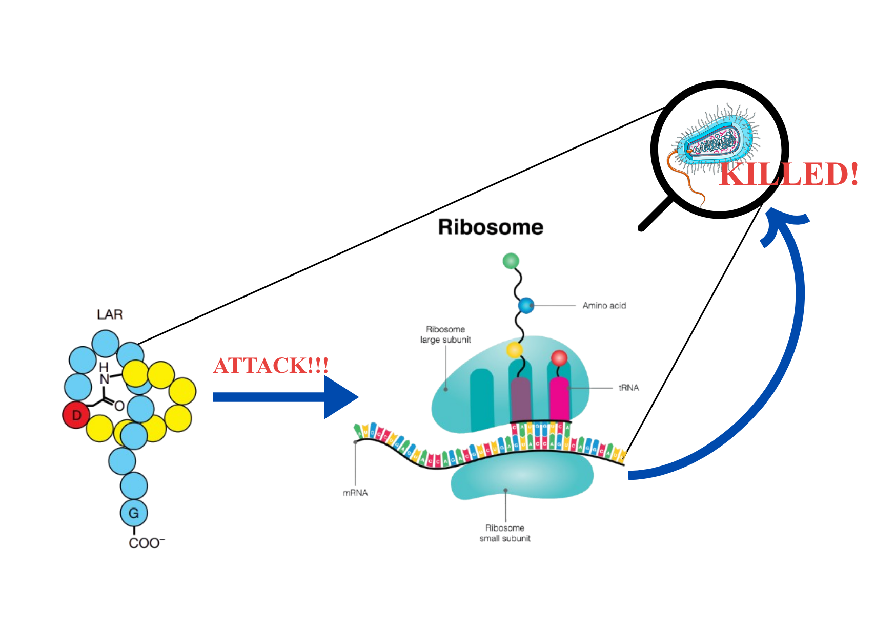

{fig-alt="Lariocidin lasso peptide illustration" width="100%"}

## From Golden Era to Global Crisis

It all began in 1928 when Alexander Fleming discovered that a fungus (*Penicillium notatum*) had contaminated his culture plate of *Staphylococcus* bacteria. He noticed something odd, the bacteria simply could not grow near the fungus. This was the first time we had figured out how to weaponize one organism against another, and boom, the era of antibiotics began.

The golden age lasted from the 1940s to the mid-1960s. Streptomycin, vancomycin, and a whole arsenal of antibiotics kept turning up with each new experiment, helping people overcome infections that had once been death sentences.

But then, in the 1970s, a "drought" started emerging in the sea of antibiotics. Scientists either kept rediscovering the same antibiotics in new forms, or stumbled upon novel ones that were toxic to humans too. And worst of all, the bacteria launched their own warfare: **antibiotic resistance;** evolving ways to make our existing antibiotics completely useless against them.

Think of it like a lock and key. Antibiotics are the keys. But bacteria started changing the locks. Fast.

Antibiotic resistance has been globally acknowledged as a crisis. It killed more than **4.5 million people in 2019 alone**. This made the hunt for new antibiotics more urgent than ever — ones that could fight resistant bacteria while being completely safe for humans.

And after a dry spell spanning over four decades, the sea finally sprung back to life. In 2025, researchers from McMaster University, Canada, discovered a completely new antibiotic — **Lariocidin**.

---

## What Even Is Lariocidin?

Before we get to lariocidin itself, a quick detour into the world of peptide antibiotics.

Many medically used antibiotics are peptides — short chains of amino acids produced by special enzymes in bacteria and fungi. There is also a specific class of peptide antibiotics built with the help of ribosomes, called **Ribosomally Synthesized and Post-translationally Modified Peptides**, or **RiPPs.** These peptides undergo modifications after they are made, like dehydration or cyclization to reach their final, active structure. These modifications help them interact with their targets and protect them from being broken down by the cell.

Within RiPPs, there is a particularly cool subgroup called **lasso peptides**. Imagine a cowboy's lasso — a rope tied into a loop with a tail threaded through it. Lasso peptides have exactly that structure: their C-terminal tail is threaded through an intramolecular loop, making them incredibly stable. It is this "knotted" structure that gives them their name.

Lariocidin is one such lasso peptide. And its target? The **ribosome** of the pathogen.

Ribosomes are the cell's protein factories — they read the genetic instructions and build every protein the cell needs. No ribosomes, no proteins. No proteins, no cell. This makes ribosomes an excellent target for antibiotics.

---

## What Makes Lariocidin Special?

You might be thinking: "Other antibiotics already target the ribosome. What's the big deal?"

Fair point. But here is the catch. Those other ribosome-targeting compounds bind to specific, well-characterized sites that are so well-understood by now that bacteria have had time to develop resistant genes that render those inhibitors useless.

Lariocidin avoids this problem entirely. It binds to a **lesser-known, "non-popular" site** on the ribosome — one that bacteria have not yet figured out how to defend.

Here is what it does once it gets there: it disrupts **translocation** (the movement of mRNA and tRNA during protein synthesis), and by interacting with the tRNA, it causes **miscoding**, the ribosome starts misreading the genetic instructions. The result? Faulty, non-functional proteins get made, and the cell shuts down.

But wait, it gets even better.

Unlike many antibiotics that rely on specific protein importers to enter bacterial cells, lariocidin gets in by exploiting something all bacteria share: their **electrical charge**. Every bacterium maintains an electrical gradient across its membrane — lariocidin uses this universal feature as its entry ticket, which is why it works against such a wide range of bacteria.

It is effective against:
- Gram-positive bacteria
- Gram-negative bacteria
- Mycobacteria
- *Acinetobacter baumannii*; one of the most notoriously drug-resistant pathogens on the WHO's critical list

On top of all that, its activity does not deteriorate in conditions that mimic the human body, and it shows **no toxicity to human cells** or the good bacteria in the human microbiome. It targets the invaders, not you.

---

## The Discovery: A Year in the Dirt

Here is where the story gets truly fascinating and a little humbling.

The main character in the origin story of lariocidin is **patience** and **time.**

Researchers grew soil bacteria not for days, not for weeks, not even for months — but for an **entire year**. The reason? Most lab experiments stop early, accidentally ignoring the slowest-growing bacteria. This team decided not to.

That year-long wait led them to a strain called **M2** from the *Paenibacillus* species. M2 was already producing a known antibiotic, colistin but it was also producing something else. A mystery compound that showed activity even against a colistin-resistant strain of *E. coli*.

This new substance had a molecular weight completely different from colistin, and it did not match anything in existing databases. A true unknown.

The researchers then sequenced the M2 genome and found a gene cluster pointing to a potential lasso peptide and its predicted mass and amino acid composition matched those of the mystery compound perfectly. To confirm they had the right genes, they cloned the gene cluster into a different host (*Streptomyces*), and that host produced the exact same compound.

Using **NMR and X-ray crystallography**, they then visualized the 3D structure — and there it was. The characteristic lasso-like knot. The mystery compound was **lariocidin**.

---

## What Comes Next?

Lariocidin has shown activity against multiple bacteria that WHO has classified as "critical pathogens." The researchers also found that lariocidin-like gene clusters are highly conserved and widespread in nature — meaning there could be more of these hiding in soil across the world.

This also gives scientists a **chemical scaffold** to work from; a structural template to refine and develop even more potent versions of the drug. The current focus is on optimizing lariocidin for better efficacy and scaling up production for clinical development.

If the golden age of antibiotics was built on curiosity and luck, this new chapter seems to be built on something equally powerful: patience.

Had the researchers stopped incubation a few weeks early, lariocidin would have remained just another unknown molecule in dirt. Patience, it turns out, is not just a virtue in life — it is a an important research strategy.

---

Want to discuss this paper? Have questions? Reach out!

📧 **Email:** [](mailto:)

Feel free to share your thoughts, corrections, or follow-up questions. We'd love to hear from you!

### References

1. The history of antibiotics. (n.d.). Microbiology Society. <https://microbiologysociety.org/why-microbiology-matters/knocking-out-antimicrobial-resistance/amr-explained/the-history-of-antibiotics.html>

2. Dattani, S. (2024, December 23). What was the Golden Age of Antibiotics, and how can we spark a new one? *Our World in Data*. <https://ourworldindata.org/golden-age-antibiotics>

3. MinuteEarth. (2026, February 5). 40 years without a new antibiotic. Why? [Video]. YouTube. <https://www.youtube.com/watch?v=hItlmfXZBQU>

4. Jangra, M., Travin, D. Y., Aleksandrova, E. V., Kaur, M., Darwish, L., Koteva, K., Klepacki, D., Wang, W., Tiffany, M., Sokaribo, A., Chen, X., Deng, Z., Tao, M., Coombes, B. K., Vázquez-Laslop, N., Polikanov, Y. S., Mankin, A. S., & Wright, G. D. (2025). A broad-spectrum lasso peptide antibiotic targeting the bacterial ribosome. *Nature*, 640(8060), 1022–1030. <https://doi.org/10.1038/s41586-025-08723-7>

5. Verma, S. (2025, August 12). McMaster researchers discover new class of antibiotics. *McMaster News*. <https://news.mcmaster.ca/mcmaster-researchers-discover-new-class-of-antibiotics-gerry-wright-lariocidin-hamilton-soil/>

