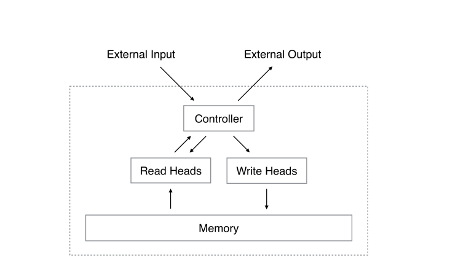

{fig-alt="Neural Turing Machine illustration" width="100%"}

Picture this: your professor walks in and drops an assignment on your desk — *"Write a report on World War history: key events, causes, consequences etc."*

You don't panic. Even before you start, you already know a few things: world wars belong in the history section, certain names and dates ring a bell. That quick, ready-to-use knowledge sitting in your head? That's your **working memory**. Small, fast, and just enough to get you started.

Now you head to the library.

**Today's paper:** "Neural Turing Machines" by Alex Graves, Greg Wayne & Ivo Danihelka (2014)

## The Library Analogy

The library is **memory** — a massive space storing everything. You, the student trying to finish the assignment, are the **controller** — deciding what to search, what to skip, and what to "copy" into your notes. The assignment itself is the **external input/output**: the task you received, and the final submission you'll make.

This is basically the architecture of a Neural Turing Machine (NTM). A controller (usually a neural network) that reads from and writes to an external memory bank — just like a student working through a library.

## Two Ways to Search

You start the obvious way: type keywords into the search bar. *"World War… Hitler, Holocaust, Allies, Jews."* You find what you're looking for by matching what you already know to what's in the library. This is **content-based addressing** — finding things by what they're about.

But after a while, you hit a wall. The same popular books keep showing up. Then a librarian tips you off: *"Walk a few shelves down from where you are, and you'll find more."* You follow the tip and suddenly stumble on wartime economics, diplomatic backstories, memoirs you never would have searched for directly. This is **location-based addressing** — instead of searching by meaning, you just move to a nearby "address" and see what's there.

NTMs use both. Sometimes you search by content, sometimes by location, often a mix of both.

## The Blurry Spotlight

Here's something interesting: you rarely read one single book cover to cover. You pull several, skim quickly, compare passages, blend ideas. Even when you "pick" a source, your attention is spread across a few — some directly useful, some partially, some just providing context.

That's exactly how reading and writing works in an NTM. You don't point to one memory slot and say "that one." You get a **blended signal** from multiple slots, weighted by how relevant each one is.

This blending is controlled by **attentional focus** — like a spotlight. When you're confident, the spotlight narrows. When you're exploring, it widens. And what shapes the spotlight is a mix of your two search methods: how much you rely on content vs. location.

## The Cool Part: It Learns as It Goes

Here's what makes this more than just a clever analogy. After hours in the library, you get *better*. Better at picking keywords, better at judging which shelves to wander, better at knowing when to trust the search bar vs. when to follow your nose.

In an NTM, the controller learns the same way. The whole system is **differentiable** — meaning it can be trained through backpropagation, the same way regular neural networks learn. The controller (an LSTM, essentially the "brain") reads the task, keeps the current plan in mind, and gets better at using memory the more it practices.

## Why It Matters (And Why You Haven't Heard of It More)

Normal neural networks hit a wall on tasks that need to store and retrieve specific information over long sequences. NTMs were designed to fix exactly that. But in practice, getting them to reliably learn memory usage turned out to be tricky, and scaling them to very large memories was computationally expensive.

Still, the core idea — a model with a small working space that repeatedly consults a much larger external store — directly influenced everything that came after. The **Differentiable Neural Computer (DNC)** refined memory management. **Transformers** treat their context window like a library. **Retrieval-augmented models** literally fetch documents at inference time.

The student-and-library architecture never really went away. It just got scaled up.

---
Want to discuss this paper? Have questions? Reach out!

📧 **Email:** [](mailto:)

Feel free to share your thoughts, corrections, or follow-up questions. We'd love to hear from you!

### References

1. Graves, A., Wayne, G., & Danihelka, I. (2014). Neural Turing Machines. *arXiv preprint arXiv:1410.5401*. [https://arxiv.org/abs/1410.5401](https://arxiv.org/abs/1410.5401)
2. [Neural Turing Machines: Enhancing Neural Networks with Dynamic Memory and Advanced Attention Mechanisms](https://medium.com/@siddharthapramanik771/neural-turing-machines-enhancing-neural-networks-with-dynamic-memory-and-advanced-attention-dd14a6fd24b0)
3. [Unlocking the Potential of Neural Turing Machines](https://encord.com/blog/neural-turing-machines/)

