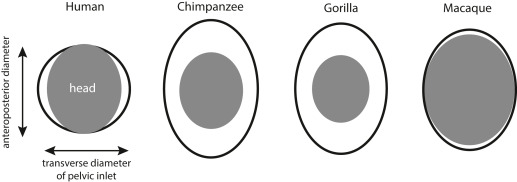

{fig-alt="Obstetrical Dilemma illustration" width="100%"}

## Ever Wondered Why Humans Need Help to Give Birth?

Consider the closest of our species, a chimpanzee — when it feels labour contractions, within a few efficient minutes it finishes delivering infants entirely alone. No nurses, no doulas. She cleans the baby herself and life continues. This is, more or less, how birth works for every mammal on the planet.

Now consider a human mother about to deliver. Even today, without any medical support, obstructed labour — where the baby's head simply cannot clear the maternal pelvis — is one of the leading causes of maternal death in the developing world.

So what went so wrong with our birth canal? And why, uniquely among all primates, did we evolve into a species that requires other people to survive childbirth? Why do we need a second pair of hands for a successful delivery, and how did it shape our social, trust, and interpersonal circles?

## Fetopelvic Disproportion and Tragedies of Obstructed Labors

The medical term is **fetopelvic disproportion (FPD)** — when the baby's head is too large for the mother's bony birth canal. In most primates, the newborn's head fits through the pelvic outlet with a generous fit. In humans, the fit is so tight that the baby must rotate during delivery, a maneuver no other primate performs. Rates of obstructed labour in humans, even in populations with good nutrition and healthcare, run at roughly 3–5% of all deliveries. In wild chimpanzees and gorillas, documented cases of obstructed labor are essentially unknown. But why?

While bipedalism (aka walking on two legs) was narrowing the pelvis from one direction, evolution was simultaneously expanding the fetal skull from the other. This is **encephalization** — the dramatic increase in brain size relative to body size that defines the *Homo* lineage. The australopithecine brain sat at roughly 450cc, barely larger than a chimpanzee's. By *Homo erectus*, it had climbed to ~900cc. By modern *Homo sapiens*, it reached ~1350cc — 3x in under two million years.

This is the collision. The pelvis could not widen freely. The brain could not stop growing. The birth canal became, quite literally, a bottleneck in the most physical sense of the word.

In 1974, a team discovered AL 288-1, better known as **Lucy** — a roughly 40% complete skeleton of *Australopithecus afarensis*, who lived approximately 3.2 million years ago. Lucy walked upright. Her pelvis showed adaptations for bipedal locomotion — the ilium (the broad upper wing of the hip bone) was shorter and more vertically oriented than in any ape, to accommodate the mechanical demands of striding on two legs. But this same reorganisation that made bipedalism possible also narrowed the birth canal.

This tug-of-war between walking upright and giving birth was named the **Obstetrical Dilemma**, a term coined by physical anthropologist Sherwood Larned Washburn in 1960.

## The Obstetrical Dilemma: A Hypothesis

Washburn proposed that evolution resolved this conflict through a compromise: deliver babies earlier, before the head grows too large to pass through. This is why human newborns, when compared to the offspring of other primates, are helpless and unable to walk — whereas baby deer can run at birth. A newborn human is neurologically so underdeveloped that it cannot even hold its own head up. Thus, they believed bipedalism forged the linkage between infant head size and the mother's pelvis.

## What's the Proof They Happened Simultaneously? Co-evolution?

The fossil record shows that the pelvis changed. Comparing anatomy over time shows how different human birth is from that of other primates. But the central claim of the obstetrical dilemma — that pelvis size and brain size were "co-evolving" — requires a different kind of evidence entirely. It requires you to look inside the genome.

Not until 2024 was this problem addressed with the right data, using the largest pelvic imaging dataset ever assembled: 31,115 individuals from the UK Biobank, whose pelvic geometry was extracted from DXA (Dual-Energy X-ray Absorptiometry) scans using deep-learning HRNets (High-ResNets) neural networks, and whose entire genomes had been sequenced.

The genetic correlation between a mother's birth canal width is a proxy to infant head size, adhering to the fact that the infant head — though distorted at birth — rebounds to 90% heritable by 4–5 months, making maternal head size its strongest genetic predictor. The paper identified 180 independent genomic loci influencing pelvic phenotypes strongly associated with mother head size, indirectly and causally influencing the head size of infants. That is, nature has been selecting specifically for the combination of wide head + wide pelvis, and against the combination of wide head + narrow pelvis. The women who had wide heads but narrow pelvises died more often in childbirth, removing that gene combination from the population!

## The Deepest Consequence: Empathy as an Evolutionary Consequence (Theory of Mind)

Birth assistance requires social trust. A labouring woman allowing another person to reach into her body in her most vulnerable moment is not performing a casual social transaction. It requires — and presumably selects for — the capacity to trust, to read intentions accurately, to form bonds of genuine emotional reciprocity. These are the foundations of what we now call **theory of mind**: the ability to model the mental states of others.

> *"A pelvis narrowed by bipedalism. A skull expanded by intelligence. A baby that must rotate through a canal that barely fits. A mother who cannot deliver alone. A community that assembles to help. A species that becomes, generation by generation, more trusting, more emotionally literate, more socially connected, because the ones who could build those bonds, survived."*

---
Want to discuss this? Have questions? Reach out!

📧 **Email:** [](mailto:)

Feel free to share your thoughts, corrections, or follow-up questions. We'd love to hear from you!

### References

1. Xu, S. et al. (2024). The genetic architecture of and evolutionary constraints on the human pelvic form. *Science*, 383(6686), eadf8671.
2. Mitteroecker P, Fischer B (2024). Evolution of the human birth canal. *AJOG*, 230, S841-S855.
3. Washburn, S.L. (1960). Tools and Human Evolution. *Scientific American*, 203(3), 62–75.
4. Krogman, W.M. (1951). The scars of human evolution. *Scientific American*, 185(6), 54–57.
5. Rosenberg, K. & Trevathan, W. (2002). Birth, obstetrics and human evolution. *BJOG*, 109(11), 1199–1206.

