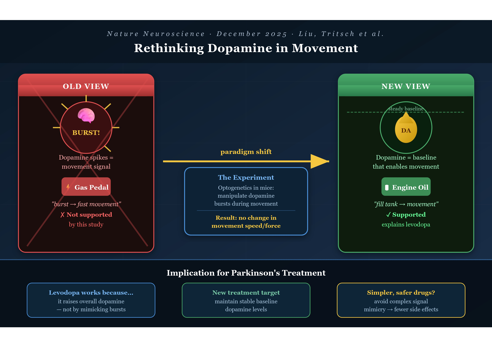
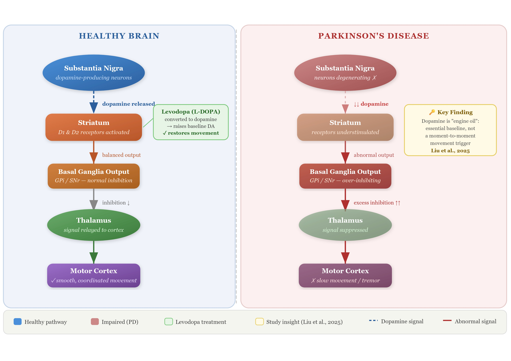

{fig-alt="Graphical abstract of dopamine and Parkinson's Disease study" width="100%"}

You've almost certainly heard of dopamine. It gets talked about constantly in discussions about social media addiction, motivation, pleasure, and reward — but dopamine's role in **physical movement** is just as profound, and far less discussed.

In Parkinson's disease, the brain cells responsible for producing dopamine gradually break down. This loss leads to the hallmark symptoms of the disease: slow movement, tremors, and problems with balance. For decades, the scientific community believed it understood *how* that loss caused those symptoms. A 2025 study suggests we may have been slightly wrong — and this has very serious implications for current treatments.

---

::: {.callout-note appearance="simple"}
**The Paper at a Glance**

**Title:** *Subsecond dopamine fluctuations do not specify the vigor of ongoing actions*

**Authors:** Haixin Liu, Nicolas X. Tritsch, et al. — McGill University

**Published in:** *Nature Neuroscience*, December 2025

**DOI:** [10.1038/s41593-025-02102-1](https://doi.org/10.1038/s41593-025-02102-1)
:::

---

## What Is Parkinson's Disease?

Before we get into the science, let's make sure we're on the same page. Parkinson's disease is not just a tremor. It is a slow, progressive loss of the brain's ability to control the body. Simple acts like buttoning a shirt, speaking clearly, or standing up from a chair become monumental efforts.

The most common treatment is **levodopa**, a drug the brain converts into dopamine. It has been the gold standard of care for decades, but for all those years, scientists haven't fully understood *why* it works the way it does. That gap in understanding has limited our ability to improve upon it.

More than 10 million people are currently living with Parkinson's disease globally, and that number is expected to double by 2050 as the population ages. This is not a rare or distant condition. It is coming for many of us.

## The Old Story: Dopamine as the "Gas Pedal"

For a long time, the dominant theory went something like this: when you want to move quickly or powerfully, your brain releases a rapid burst of dopamine — and that burst is what makes the movement fast and forceful. Dopamine was the throttle.

This theory wasn't invented carelessly. In recent years, improved brain-monitoring tools detected brief spikes of dopamine during movement. These rapid bursts led many researchers to think dopamine directly controlled movement intensity.

But here's what years of studying the brain teaches you: the brain rarely does what we expect. It is layered, redundant, and deeply surprising. And sometimes, correlation really is not causation.

## The New Story: Dopamine as the "Engine Oil"

The McGill team asked a deceptively simple question: if dopamine bursts *cause* vigorous movement, then what happens if we manipulate those bursts in real time?

The researchers monitored brain activity in mice while the animals pressed a weighted lever. Using a technique called **optogenetics** — a light-based method that lets scientists switch specific neurons on or off with extraordinary precision — they were able to manipulate dopamine-producing cells at a precise moment.

The logic was elegant: if dopamine bursts drive movement speed and force, then artificially manipulating those bursts should change how the animals moved. The researchers tested both directions — artificially boosting the dopamine signal and suppressing it, each at the precise moment a mouse began pressing the lever.

In both cases, the mice pushed with the same speed and force as normal. **Whether dopamine was turned up or turned down in that split second, it made no difference.**

This null result is enormously meaningful. Dopamine wasn't driving movement "in the moment." It was doing something else entirely.

{fig-alt="Diagram of the dopamine pathway in the brain" width="100%"}

::: {style="text-align: center; font-style: italic; margin: 1.5em 2em;"}
"Rather than acting as a throttle that sets movement speed, dopamine appears to function more like engine oil. It's essential for the system to run, but not the signal that determines how fast each action is executed."

— Nicolas Tritsch, McGill University
:::

This metaphor is genuinely beautiful in its clarity. Engine oil doesn't make your car go faster or slower. You don't press the accelerator and think about the oil. But without it, the engine seizes. That's dopamine. It is the quiet, invisible enabler — not the star of the show, but the reason the show can happen at all.

## What This Tells Us About Levodopa

This untangles a mystery that has quietly puzzled clinicians for years. Levodopa works remarkably well — but why? If dopamine's moment-to-moment surges were what mattered, then a drug that simply raises dopamine levels steadily shouldn't be the answer. And yet it is.

When the researchers tested levodopa, they found that the drug improved movement by raising the brain's overall dopamine level, rather than restoring the short-lived dopamine bursts that occur during motion.

::: {style="text-align: center; font-style: italic; margin: 1.5em 2em;"}
The drug works because it fills the tank with oil, not because it mimics the revving of the engine. That distinction has real clinical weight.
:::

## What This Could Mean for the Future

It's important to note: this is a mouse study. It is a crucial step, but not the finishing line. According to the researchers, a better understanding of why levodopa works could guide the development of future treatments that focus on maintaining steady dopamine levels rather than targeting rapid dopamine signals.

The findings also encourage researchers to revisit older treatment strategies. Dopamine receptor agonists have shown benefits in the past but often caused side effects because they affected large areas of the brain. This new insight may help scientists design safer therapies that act more precisely.

Rather than engineering drugs that try to replicate the complexity of split-second brain signals, researchers may be able to focus on a simpler, more stable target — keeping baseline dopamine levels adequate. In medicine, simplicity is often a profound gift.

## The Bottom Line

What this paper represents beyond its data is the willingness of scientists to challenge their own field's assumptions. To say: *we may have been wrong, and that's okay, because now we can look in the right direction.*

::: {style="text-align: center; font-style: italic; margin: 1.5em 2em;"}
"Restoring dopamine to a normal level may be enough to improve movement. That could simplify how we think about Parkinson's treatment."

— Nicolas Tritsch, McGill University
:::

For the millions of people living with Parkinson's disease and their families, that simplification could eventually translate into treatments that are more effective, more targeted, and less burdened by side effects. Science rarely moves in straight lines, but this is a meaningful step forward.

---

Want to discuss this paper? Have questions? Reach out on the below email or [LinkedIn](https://www.linkedin.com/in/laurabilbaobroch/)!

📧 **Email:** [](mailto:)

Feel free to share your thoughts, corrections, or follow-up questions. We'd love to hear from you!

### References

1. Liu H, Melani R, Maltese M, et al. Subsecond dopamine fluctuations do not specify the vigor of ongoing actions. *Nature Neuroscience.* 2025;28(12):2432. [https://doi.org/10.1038/s41593-025-02102-1](https://doi.org/10.1038/s41593-025-02102-1)

## Important Caveats

*This article is intended for general informational purposes only and does not constitute medical advice. Please consult a qualified healthcare professional for guidance specific to your health situation.*

- This study was conducted in mice, not humans. Mouse brains share important similarities with ours, but results do not always translate directly. Human trials are a long way off.

- Do not change your medication. If you or someone you love is being treated for Parkinson's, this research does not change current best practice. Levodopa remains the most effective available treatment for motor symptoms.

- One study is a beginning, not a conclusion. Scientific consensus is built over time through replication and debate. These findings need to be confirmed by independent teams before reshaping clinical practice.
